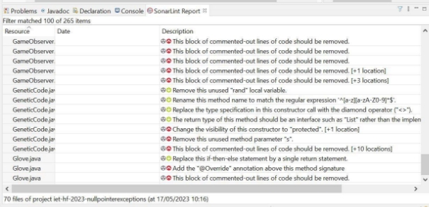
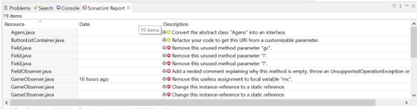

**Github** 

A kód feltöltése és elrendezése a repository-ba. A projekt ezelőtt is github-on volt verzió kezelve, viszont pár dolgot ki kellett javítani a projekt szerkezetén.

**Manuális kód átvizsgálás**

Változónevek, metódusnevek, osztálynevek, valamint lokális változók átnevezése a jobb kódminőség, könnyebb olvashatóság érdekében.

**SonarLint alapú elemzés** 

Az egész kódban átnéztük a hibákat. Párat hagytunk csak ki melyeknek nem láttam szükségét, hogy kijavítsam.  

A projekt elején az alábbi hibákat adta ki a SonarLint: 

Miután az elemzést elvégeztük az alábbit kaptam: 

Főbb hibák: logikailag hosszú függvények refaktorálása, kikommentelt kódok törlése, absztrakt osztályok bevezetése, override bevezetése, fölösleges függvények törlése.  

**SonarCloud alapú elemzés** 

Github Actions-be gradle segítségével automatikus ellenőrzésként beüzemelése. Beüzemelés után észrevettük, hogy a SonarLint megfelelője, mely felhőt használ. Így végülis ez alapján nem végeztünk el refaktorálást.
