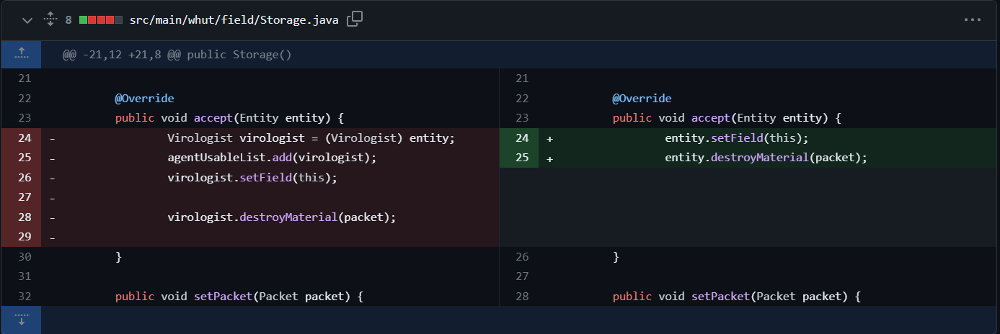
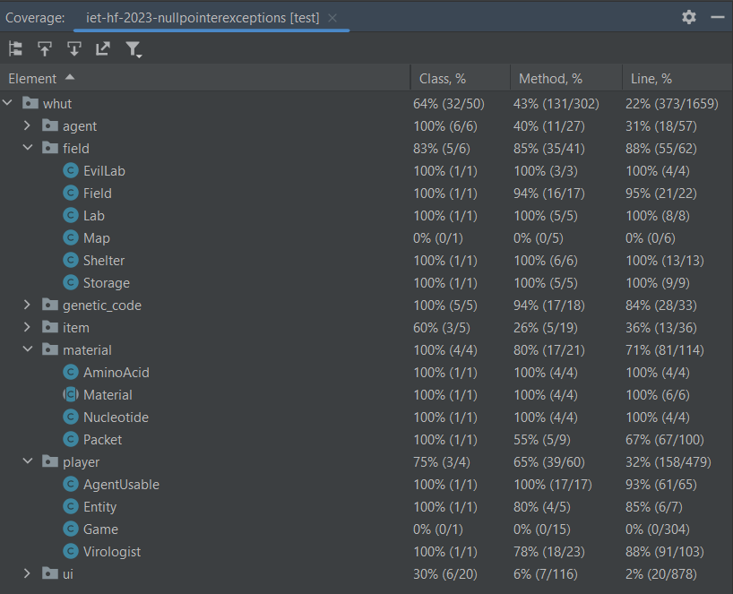

**Előkészületek**

Gradle fájl hozzáadása a projekthez, szükséges plugin-ok és függőségek felvétele, projekt fájlszerkezetének átalakítása, külön *main*, *resources*, valamint *test* mappa kialakítása a forráskódot tartalmazó fájloknak, az erőforrás fájloknak, illetve a tesztfájloknak.
A kiinduló projekt eredetileg nem tartalmazott Unit teszteket.

**Unit tesztek elkészítése**

A Unit tesztek elkészítéséhez **JUnit 5**-öt, valamint **Mockito**-t használtunk, a tesztek **Kotlin** nyelven íródtak.
Unit tesztek az *src/main/whut/field*, */material*, valamint */player* package-ekben található fájlokhoz készültek, összesen 64 darab teszt készült.

A tesztek az alábbi hibákat találták meg, amelyek javítva lettek:

A *Field*, valamint a *Storage* is egy *Entity* típust várt az *accept()* metódus paramétereként, viszont a függvényben történő cast-olás miatt a teszt exception-nel zárult. A képen látható az eredeti, valamint a javított kód:

Hasonló cast-olási hibák miatt szükséges volt több metódus paraméterének megváltoztatására is, hogy az öröklési hierarchiának megfelelően legyenek kezelve az *AgentUsable*, valamint a *Virologist* példányok.

Ezek mellett szükség volt a különböző osztályok *toString()* implementációjának pontosítására is, a könnyebb használat érdekében.

**Code coverage**

A Unit tesztek elkészítését követően teszt-lefedettség mérést is végeztem, az alábbi eredményt sikerült elérni:

